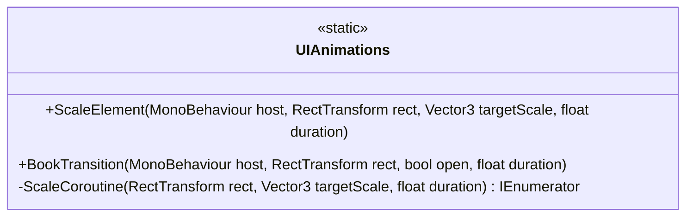
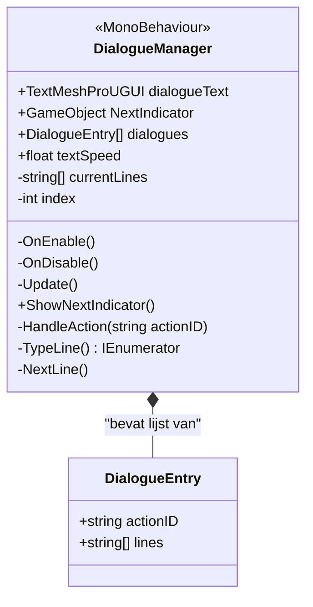
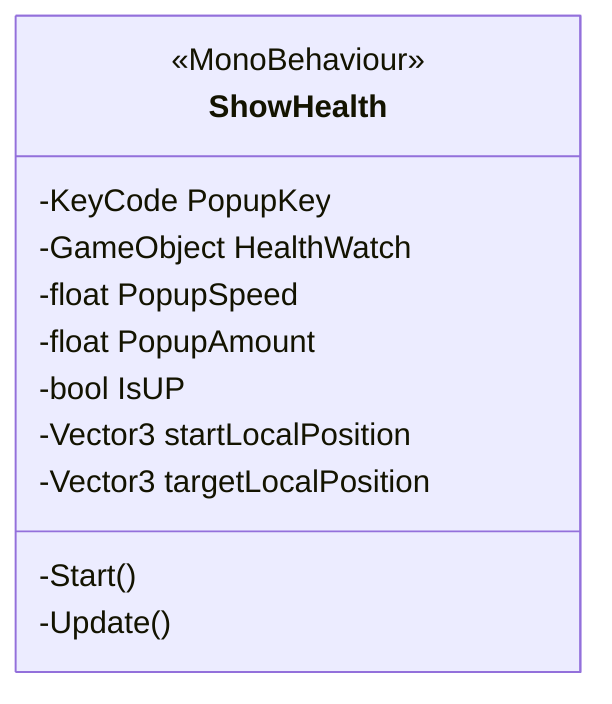

# NeoNTeamB2026

## UI animation

```mermaid
classDiagram
    class UIAnimations {
        <<static>>
        +ScaleElement(MonoBehaviour host, RectTransform rect, Vector3 targetScale, float duration)
        +BookTransition(MonoBehaviour host, RectTransform rect, bool open, float duration)
        -ScaleCoroutine(RectTransform rect, Vector3 targetScale, float duration) IEnumerator
    }
```

## Dialogue Manager

```mermaid
classDiagram
    class DialogueManager {
        <<MonoBehaviour>>
        +TextMeshProUGUI dialogueText
        +GameObject NextIndicator
        +DialogueEntry[] dialogues
        +float textSpeed
        -string[] currentLines
        -int index
        -OnEnable()
        -OnDisable()
        -Update()
        +ShowNextIndicator()
        -HandleAction(string actionID)
        -TypeLine() IEnumerator
        -NextLine()
    }

    class DialogueEntry {
        +string actionID
        +string[] lines
    }

    DialogueManager *-- DialogueEntry : "bevat lijst van"

```

## Health popup

```mermaid 
classDiagram
    class ShowHealth {
        <<MonoBehaviour>>
        -KeyCode PopupKey
        -GameObject HealthWatch
        -float PopupSpeed
        -float PopupAmount
        -bool IsUP
        -Vector3 startLocalPosition
        -Vector3 targetLocalPosition
        -Start()
        -Update()
    }
```
